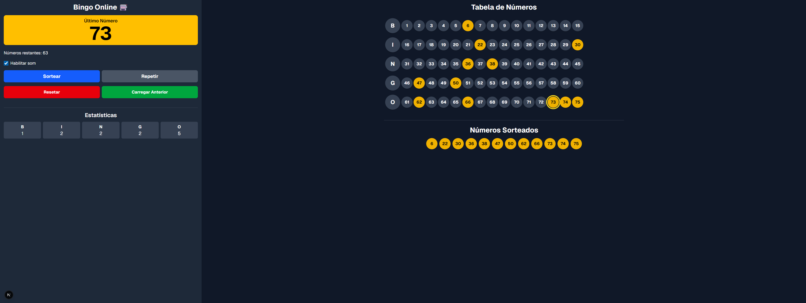
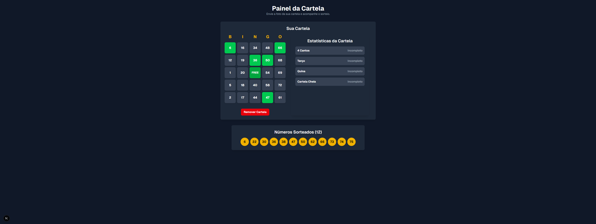

# Bingo Online 🎰

Um jogo de bingo online com uma interface limpa, sorteio de números em tempo real e um painel especial para os jogadores conferirem suas cartelas. Inclui também uma página de configurações para personalizar os padrões de vitória.

## 📸 Telas da Aplicação

### Tela Principal


### Painel da Cartela do Jogador


### Página de Configurações


## ✨ Funcionalidades

- **Sorteio em Tempo Real:** Sorteio de números com feedback de áudio para cada número sorteado.
- **Visualização Completa:** Exibição dos números já sorteados, números restantes e estatísticas por coluna.
- **Painel do Jogador (`/admin`):**
    - Envie uma imagem da sua cartela de bingo.
    - A aplicação utiliza OCR (Reconhecimento Óptico de Caracteres) para ler os números da sua cartela.
    - Acompanhe em tempo real quais números da sua cartela já foram sorteados.
    - Verifique o status de vitória com base nos padrões configurados.
- **Padrões de Vitória Customizáveis (`/settings`):
    - Uma página de configurações para habilitar ou desabilitar diferentes padrões de vitória (4 cantos, terço, quina, cartela cheia).
    - Configure variações para os padrões, como linhas horizontais, verticais ou diagonais.
- **Estatísticas da Cartela:** O painel do jogador exibe estatísticas em tempo real, mostrando se um padrão de vitória foi alcançado.

## 🚀 Tecnologias Utilizadas

- **[Next.js](https://nextjs.org/)** - Framework React para produção.
- **[TypeScript](https://www.typescriptlang.org/)** - Superset de JavaScript que adiciona tipagem estática.
- **[Tailwind CSS](https://tailwindcss.com/)** - Framework de CSS para design rápido e responsivo.
- **[Tesseract.js](https://tesseract.projectnaptha.com/)** - Biblioteca de OCR para extrair números das imagens das cartelas.

## 🏁 Como Executar o Projeto

Primeiro, instale as dependências:

```bash
npm install
```

Depois, execute o servidor de desenvolvimento:

```bash
npm run dev
```

Abra [http://localhost:3000](http://localhost:3000) no seu navegador para ver o resultado.

## 📄 Páginas

- **Página Principal (`/`)**: A tela principal do jogo de bingo, onde os números são sorteados e exibidos na tabela.
- **Painel da Cartela (`/admin`)**: A página onde os jogadores podem enviar e verificar suas cartelas.
- **Configurações (`/settings`)**: A página para configurar os padrões de vitória do jogo.
